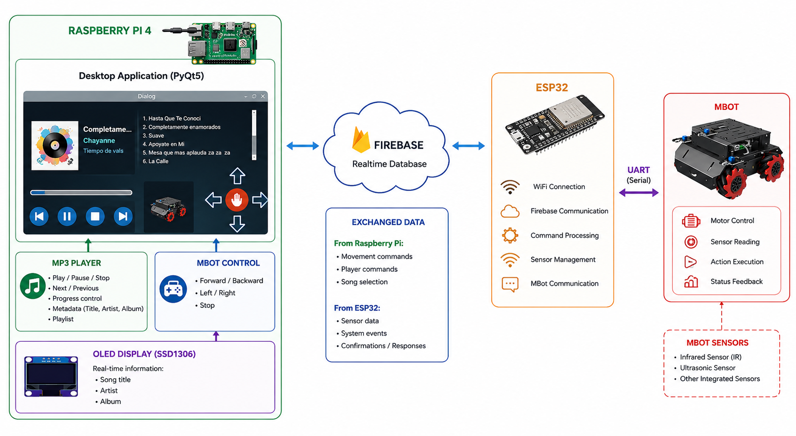

# MBot Multimedia Control System

> **Academic project developed for the course *Diseño de Sistemas en Chip* (March – June 2023).**

## Team

* José Diego Tomé Guardado
* Pamela Hernández Montero
* Victor Manuel Vázquez Morales
* Ángel Estrada Centeno

## Overview

This project combines multimedia playback, embedded systems, wireless communication, and robotic control into a single integrated platform.

A desktop application running on a Raspberry Pi 4 provides a graphical user interface capable of controlling both an MP3 player and an MBot mobile robot. Communication between the desktop application and the robot is performed through Firebase Realtime Database, allowing bidirectional exchange of commands and events.

The system also integrates an SSD1306 OLED display, an infrared remote control, and onboard robot sensors to create an interactive multimedia and robotic control experience.

## System Components

### Raspberry Pi 4

Runs the desktop application developed in Python and PyQt5.

Responsibilities:

* MP3 playback and playlist management.
* Song metadata visualization.
* OLED display updates.
* MBot movement control.
* Firebase communication.
* Processing events generated by the robot.

### ESP32

Acts as a communication gateway between Firebase and the MBot.

Responsibilities:

* WiFi connectivity.
* Firebase communication.
* Infrared remote control processing.
* UART communication with the Arduino Mega.
* Sensor event forwarding.

### MBot Platform

Responsible for robot movement and sensor monitoring.

Responsibilities:

* Motor control.
* Sensor acquisition.
* Execution of movement commands.
* Event reporting.

## Main Features

### Multimedia System

* MP3 playback.
* Play / Pause / Stop controls.
* Previous / Next track selection.
* Playlist visualization.
* Song metadata extraction (Title, Artist, Album).
* Playback progress tracking.

### Robot Control

* Forward movement.
* Backward movement.
* Left turn.
* Right turn.
* Stop command.

### Embedded Systems

* SSD1306 OLED display.
* Infrared remote control support.
* Sensor-triggered events.
* UART communication.
* FreeRTOS-based task scheduling.

## Technologies Used

### Software

* Python
* PyQt5
* Pygame
* EyeD3
* Firebase Realtime Database

### Embedded

* Raspberry Pi 4
* ESP32
* Arduino Mega
* FreeRTOS
* SSD1306 OLED Display

## Demonstration Video

A demonstration video showing the complete system in operation can be found here:

**[Insert Video Link Here]**

## Project Preservation Notes

This repository is preserved as an archive of the original academic project completed in 2023.

No functional redesigns, refactors, or feature modifications have been intentionally introduced. The only changes performed during archival were related to:

* Repository organization.
* Documentation improvements.
* Asset restructuring.
* Removal of unnecessary or machine-specific files.
* Reduction of multimedia assets to demonstration samples.

Although care was taken to preserve the original functionality, it is possible that small inconsistencies may exist due to differences between the original development environment and modern systems.

Examples may include:

* File path adjustments.
* Dependency version differences.
* Operating system specific behavior.
* Hardware availability.

These issues should generally be minor and can typically be resolved with small manual adjustments if the project is rebuilt.

## Academic Context

Course:

**Diseño de Sistemas en Chip**

Institution:

**Tecnológico de Monterrey**

Period:

**March 2023 – June 2023**

---

This repository is maintained primarily for educational, archival, and portfolio purposes.
